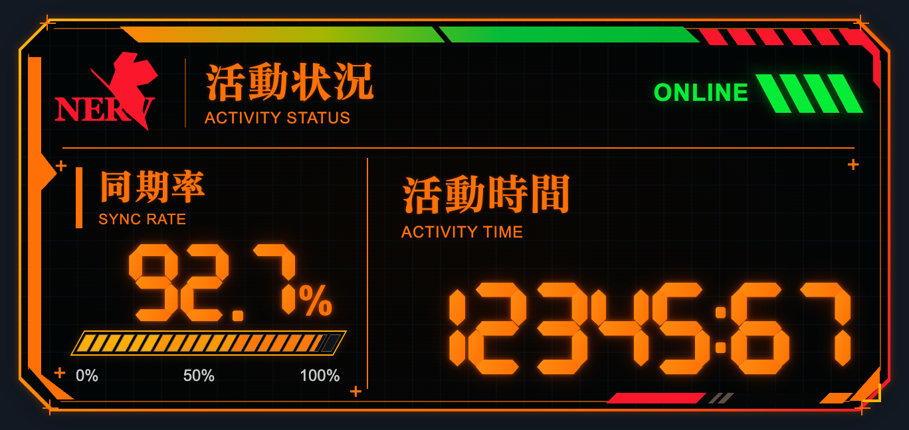
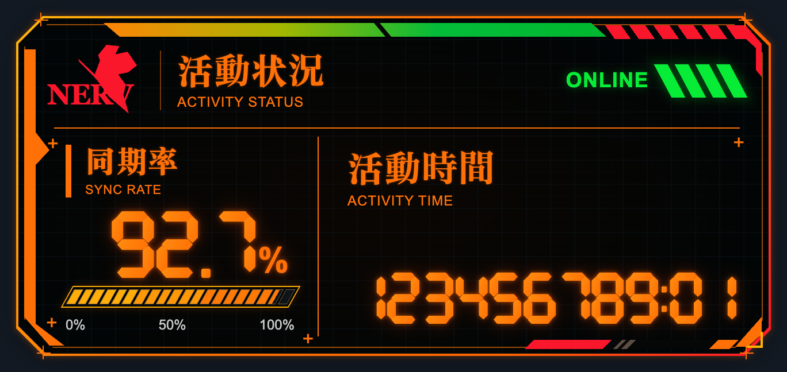

# EVA 同步终端 · dsh-xxnerv-eva

一个住在 DeepSeek Harness 窗口里的 EVA 风格同步终端。默认显示两个读数：

| 读数 | 含义 | 数据来源 |
| --- | --- | --- |
| **同步率** | 当前会话的缓存命中率（cache-read ÷ 计费输入 token） | `tokenUsage` 会话投影（`@deepseek-ai/dsh-token-meter`） |
| **活动时间** | 账户剩余金额（充值余额 + 赠送余额） | `remote.account.getBalance()`（`@deepseek-ai/dsh-api-account-controller`） |

两个来源都是 profile 已经组装好的宿主能力，本插件不自建 Host 服务、不发模型请求、不新开端口、不读聊天内容。

同步率的算法与宿主会话统计里的缓存命中率逐位一致：分母是 `uncachedInputTokens + cacheReadTokens + cacheWriteTokens`，并且**部分命中永远不会被四舍五入成 100%** —— 99.99% 会显示成 `99.99%` 而不是 `100%`。金额则沿用宿主账户页的规则：两位小数、截断而非四舍五入、不足一分显示 `<¥0.01`。

## 效果图

主面板。同步率取当前会话的缓存命中率，活动时间取账户剩余金额；`12345:67` 读作 `¥12345.67`，小数点显示为冒号：



余额位数变多时，七段数字自动缩小字号，保留全部数字与两位小数，不做 `K` / `M` 缩写、也不截断：



## 安装

本插件是普通的 DSH bundle，通过 DSH 官方的插件安装通道安装，不手工改 profile 文件。

环境要求：DeepSeek Harness `^0.2.0-rc.2`（见 `package.json` 的 `engines`）；从源码构建时需要 Node.js `>= 22`。

1. 打开 DSH 侧边栏的 **Plugins** 页面。
2. 在安装输入框里填入这个包的绝对路径。从零开始的话先克隆：

   ```bash
   git clone https://github.com/Teagnes/dsh-xxnerv-eva
   ```

   然后填入克隆下来的目录，例如：

   ```text
   /path/to/dsh-xxnerv-eva
   ```

3. 安装完成后，页面会显示插件行 `xxnerv-eva`；接着**完全退出 DSH 再打开**（⌘Q，关窗口不算），机体才会出现在窗口右下角。

卸载就在同一个页面里移除该 bundle。

### 为什么必须重启而不是刷新页面

Host 在插件**激活时**把 `client.js` 的字节读进内存（`@deepseek-ai/dsh-client-modules` 的 `initialBundleSnapshot`），之后一直用内存里的字节提供服务。磁盘上的新字节只有经 HMR 的模块根目录监听才会重新进入组合，而 profile 的 `hmr` 行配置是 `root: []`（模块根目录是 opt-in），所以**改动 `client.js` 之后刷新页面不够，必须完全退出应用重开**。

不需要卸载重装：本地路径安装是软链接，包内容原地生效。

## 使用

- **拖动**面板任意位置可移动；**右下角把手**拖动缩放，或在设置面板里**填写显示大小**（20–150%，即 132×60 至 990×450 像素）。位置与缩放存在浏览器本地存储里。
- 缩放不会连带把面板挪走：把手拖动时钉住左上角，并把量程限制在右下还有空位的范围内；数字框没有可抓的角，因此改为**钉住面板贴的那条边**，把尺寸变化全部花在朝屏幕内侧的方向上。面板停在右下角时，右下角不动、向左上生长，放大后再缩回会回到原位。
- **点击**面板说一句话。
- **右键**（或按 <kbd>Enter</kbd>）打开设置面板：余额明细、活动情报、显示大小、动态效果，以及**收起 EVA**（面板内首个按钮）和刷新余额。
- 面板获得键盘焦点时，**方向键**微调位置（按住 <kbd>Shift</kbd> 步长更大）。

主面板和右键详情中的读数均对应真实数据：

| 面板格子 | 数据 |
| --- | --- |
| 同期率 SYNC RATE | 当前会话缓存命中率 |
| 同期率下方的进度条 | 上下文窗口**使用**比例（占用率），0–100%，超过 85% 转红 |
| 活動時間 ACTIVITY TIME | 剩余金额，**不带货币符号、小数点显示为冒号**（`¥15.91` → `15:91`） |
| 外部接続 EXTERNAL LINK | 与 Host 的连接状态 |
| 系统状态（右键详情） | 由同步率与余额推出的四态：通常 / 警戒 / 待机 / 断线 |
| 活动情报（右键详情） | 该会话最后活动时间、本会话累计计费 token |
| 活动电力残量（右键详情） | 上下文窗口**剩余**占用（1 − 占用率） |
| 上下文负荷（右键详情） | 上下文窗口占用率 |

参考图里的「終了時刻」「残り時間」「内部温度」在 DSH 里没有对应数据，因此没有加入虚构读数。
- 收起后，**机体原来的位置**会出现「唤回机体」按钮（不是窗口右下角——那里是宿主 chrome 和其他插件的收起胶囊所在地，whale-pet 用的正是 `right: 18px` / `bottom: 18px`，两边会叠在一起）。

### A 版外观

默认面板为 **660 × 300**，缩放范围 **20–150%**，按百分比数字填写，位置偏好一并保留。左侧约四成用于同步率，右侧约六成用于余额；余额右对齐，长读数自动缩小七段数字字号，保留全部数字与两位小数，不用 `K` / `M` 缩写。

主面板只显示活动状况、连接状态、同步率及余额。同步率下方那条黄橙色斜切进度条展示的是**上下文窗口的使用比例**（不是同步率的重复——同步率已经由它上方的大号七段数字表示）；刻度为 0% / 50% / 100%，占用超过 85% 时转为红色。原有的系统状态、活动记录、累计 token、上下文剩余量与占用率保留在右键详情中。窗口占用或同步率缺失时显示 `--` 和空条，不显示虚构进度。

机体状态：`linked`（读数正常）、`standby`（还没有会话数据）、`alert`（同步率低于 30%，或余额低于 ¥5）、`offline`（与 Host 连接断开）。

## 配置

插件没有自己的 cordis 配置项。所有可调项都在设置面板里，只影响本机浏览器显示。

唯一与版本相关的常量是发给账户接口的 `x-client-version`，见 `src/account.js` 的 `CLIENT_VERSION_FALLBACK`。浏览器启动载荷里没有版本字段，DSH 自己的账户页也是带一个编译期常量；该值只影响 Platform 侧的请求标注，不影响余额读取本身。若某个 shell 暴露了 `globalThis.__DSH_CLIENT_VERSION__`，本插件会优先使用它。

## 运行边界

- 不修改 DSH 本体，不新增 Host 插件（`index.js` 的 `apply()` 是空的，这一行只为装载浏览器 bundle 而存在）。
- 只通过已有连接读取数据，不新增监听端口、遥测或外部请求；不读取或转发任何聊天内容、工具结果或附件。
- 只读取会话的 `tokenUsage` 投影（纯计数）与账户余额，不写任何会话事件。
- 余额取自 **Remote 命名空间服务**：DSH 把每个命名空间注册成独立的 Cordis 服务（`remote.account`），并且**只有在该 fiber 的 `inject` 里声明过的读取方才能访问它** —— 只声明 `remote` 会被 Cordis 拒绝（`cannot get property "remote.account" without inject`）。所以插件顶层 `inject` 里同时声明 `remote` 和 `remote.account`，与宿主自己的消费方（`dsh-client-ui-settings-account`、`dsh-client-ui-commands`、`dsh-client-ui-sidebar-documentpreview`）写法一致。代价是：若某个 profile 没有组装账户控制器，整行不会激活（连同步率也不显示）；这是宿主自己账户页也接受的同一个依赖。
- 视觉部分全部在 shadow DOM 内，只引用宿主的 `--dsw-alias-*` 主题变量；不 `require` 任何 DSH 客户端包（除 `react`）。

### 两个容易踩的 DSH 契约细节

这两条都让我实际踩过，写下来免得下次再犯：

1. **Direct Remote 方法返回的是操作信封，不是载荷。** `remote.account.getBalance(...)` resolve 出来的是 `{ ok: true, value: <载荷> }`，失败时是 `{ ok: false, error }`（传输故障也折叠进这一支）。直接在信封上读 `.status` 只会得到 `undefined`。宿主的账户页写的是 `if (!result.ok) throw …; return result.value;`，本插件用 `unwrapRemoteResult()` 做同一件事，并且对没有 `ok` 字段的裸载荷宽容放行。
2. **`remote.<namespace>` 必须在同一个 fiber 的 `inject` 里声明。** 它不是一个普通属性，而是按 `remote.<namespace>` 名字注册的独立 Cordis 服务；只声明 `remote` 会被拒绝。

## 开发

```sh
node tools/build.mjs      # 由 src/ 生成 client.js
node --test tests/*.test.mjs
```

`client.js` 是构建产物，必须与 `src/` 一起提交；测试会在 `src/` 比 `client.js` 新时报错。

源码结构：

| 文件 | 职责 |
| --- | --- |
| `src/i18n.js` | 中英文案与语言归一化 |
| `src/prefs.js` | 本地偏好、位置解析与锚点冻结 |
| `src/usage.js` | 缓存命中率与同步率取整 |
| `src/balance.js` | 余额的精确十进制加法与格式化 |
| `src/segments.js` | 七段数字的掩码表与读数拆解 |
| `src/view.js` | 纯视图模型（状态机 + 上下文占用） |
| `src/account.js` | 余额读取通道 |
| `src/controller.js` | DSH 订阅接线（会话、投影、连接、余额） |
| `src/widget.js` | shadow DOM 界面，不依赖任何 DSH API |
| `src/adapter.js` | 唯一的 DSH 契约层：注册 `shell.overlay` 条目 |

## 美术与商标

插件图标与面板叶形标识（`assets/icon.svg`、`assets/unit.svg`）是根据确认的参考风格重新绘制的本地几何矢量图；面板使用 NERV 字样作非官方风格致敬，未嵌入参考截图。相关名称、标识及衍生形象的权利归各自权利人，不因代码的 MIT 许可而授予。

鼠标悬浮时显示的一行日文引用自该作品的一句台词（`bubble.quote`）；这是单句引用，不构成本插件对原作台词的转写或汇编。除此之外，气泡里按状态轮换的短句均为本插件自撰。

EVA / Evangelion 及相关形象、台词的权利属于其权利人；本插件是非官方的风格致敬作品，与权利人无关，也不代表任何官方立场。代码以 MIT 许可发布；第三方名称、标识、衍生形象及引用的台词不在该许可授予范围内。
